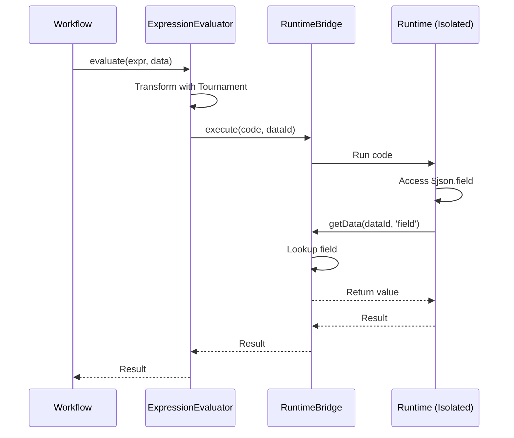
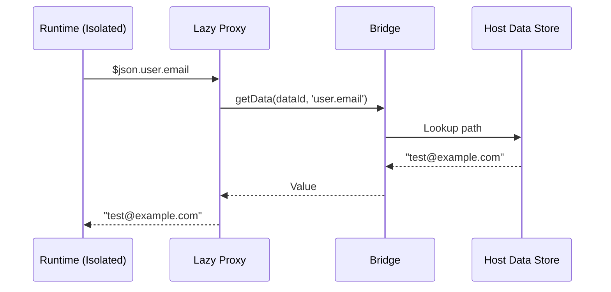

# Expression Runtime Architecture

This package provides a secure, isolated expression evaluation runtime that works across multiple execution environments (isolated-vm, Web Workers, and task runners).

## Design Goals

1. **Environment Agnostic**: Single codebase that works in Node.js (isolated-vm), browsers (Web Workers), and task runner processes
2. **Security**: Expressions run in isolated contexts with memory limits and timeouts
3. **Performance**: Lazy data loading, code caching, and efficient data transfer
4. **Observability**: Built-in metrics, traces, and logs
5. **Maintainability**: Clear separation of concerns with well-defined interfaces

## Three-Layer Architecture

The architecture is split into three distinct layers:

```
┌─────────────────────────────────────────────────────────┐
│                     Host Process                        │
│                                                          │
│  ┌────────────────────────────────────────────────┐   │
│  │         ExpressionEvaluator (Layer 3)          │   │
│  │  - Public API                                   │   │
│  │  - Tournament integration                       │   │
│  │  - Code caching                                 │   │
│  │  - Observability                                │   │
│  └────────────────┬───────────────────────────────┘   │
│                   │                                     │
│  ┌────────────────▼───────────────────────────────┐   │
│  │           Bridge (Layer 2)                      │   │
│  │  - IsolatedVmBridge                             │   │
│  │  - WebWorkerBridge                              │   │
│  │  - TaskRunnerBridge                             │   │
│  └────────────────┬───────────────────────────────┘   │
│                   │ IPC/Message Passing                │
└───────────────────┼─────────────────────────────────────┘
                    │
┌───────────────────▼─────────────────────────────────────┐
│              Isolated Context                           │
│                                                          │
│  ┌────────────────────────────────────────────────┐   │
│  │            Runtime (Layer 1)                    │   │
│  │  - Runs inside isolation                        │   │
│  │  - No Node.js dependencies                      │   │
│  │  - Lazy loading proxies                         │   │
│  │  - Helper functions ($json, $item, etc.)        │   │
│  │  - lodash, Luxon                                │   │
│  └────────────────────────────────────────────────┘   │
│                                                          │
└──────────────────────────────────────────────────────────┘
```

### Layer 1: Runtime (Isolated Context)

**Location**: Runs inside the isolated context (isolate, worker, subprocess)

**Purpose**: Provides the JavaScript execution environment for expressions

**Key Components**:
- **Lazy Loading Proxies**: Fetch data fields on-demand from host to avoid memory limits
- **Helper Functions**: `$json`, `$item`, `$input`, `$`, etc.
- **Libraries**: lodash, Luxon (bundled)
- **No Node.js APIs**: Pure JavaScript only

**Bundle**: IIFE format for isolated-vm, ESM for Web Workers

### Layer 2: Bridge (Host Process)

**Location**: Runs in the host process

**Purpose**: Manages communication between host and isolated context

**Key Components**:
- **RuntimeBridge Interface**: Abstract interface for all bridge implementations
- **IsolatedVmBridge**: Uses isolated-vm API for Node.js backend
- **WebWorkerBridge**: Uses postMessage API for browser
- **TaskRunnerBridge**: Uses IPC for separate processes

**Responsibilities**:
- Initialize isolated context
- Transfer code to context
- Handle data requests from runtime (lazy loading)
- Enforce memory limits and timeouts
- Dispose of context when needed

### Layer 3: Evaluator (Host Process)

**Location**: Runs in the host process

**Purpose**: Public API for expression evaluation

**Key Components**:
- **ExpressionEvaluator**: Main class used by workflow package
- **Tournament Integration**: AST transformation and security validation
- **Code Caching**: Cache compiled expressions
- **Observability**: Emit metrics, traces, and logs

**Responsibilities**:
- Accept expression strings and workflow data
- Transform expressions with Tournament
- Use bridge to evaluate in isolated context
- Handle errors gracefully
- Emit observability data

## Data Flow

### Expression Evaluation Flow



### Lazy Data Loading



## Environment-Specific Implementations

### IsolatedVmBridge (Node.js Backend)

Uses [isolated-vm](https://github.com/laverdet/isolated-vm) for V8 isolate-based isolation:

```typescript
class IsolatedVmBridge implements RuntimeBridge {
  private isolate: ivm.Isolate;
  private context: ivm.Context;

  async initialize(): Promise<void> {
    this.isolate = new ivm.Isolate({
      memoryLimit: 128
    });
    this.context = await this.isolate.createContext();

    // Load runtime code
    await this.context.eval(runtimeCode);
  }

  async execute(code: string, dataId: string): Promise<unknown> {
    // Implementation...
  }
}
```

### WebWorkerBridge (Browser Frontend)

Uses Web Workers for browser-based isolation:

```typescript
class WebWorkerBridge implements RuntimeBridge {
  private worker: Worker;

  async initialize(): Promise<void> {
    this.worker = new Worker('/runtime.worker.js');
    // Setup message handlers
  }

  async execute(code: string, dataId: string): Promise<unknown> {
    // Implementation...
  }
}
```

### TaskRunnerBridge (Separate Process)

Uses task runner IPC for code node evaluation:

```typescript
class TaskRunnerBridge implements RuntimeBridge {
  private taskRunner: TaskRunner;

  async initialize(): Promise<void> {
    // Setup IPC with task runner
  }

  async execute(code: string, dataId: string): Promise<unknown> {
    // Implementation...
  }
}
```

## Package Structure

```
packages/@n8n/expression-runtime/
├── ARCHITECTURE.md              # This file
├── package.json
├── tsconfig.json
├── vitest.config.ts
├── esbuild.config.ts            # Bundle configuration
│
├── src/
│   ├── types/                   # TypeScript interfaces
│   │   ├── runtime.ts           # Runtime interface
│   │   ├── bridge.ts            # RuntimeBridge interface
│   │   └── evaluator.ts         # ExpressionEvaluator types
│   │
│   ├── runtime/                 # Layer 1 (runs in isolation)
│   │   ├── index.ts             # Entry point (bundled)
│   │   ├── lazy-proxy.ts        # Lazy loading proxy
│   │   ├── helpers.ts           # $json, $item, etc.
│   │   └── globals.ts           # Global setup
│   │
│   ├── bridge/                  # Layer 2 (host process)
│   │   ├── runtime-bridge.ts    # Interface
│   │   ├── isolated-vm.bridge.ts
│   │   ├── web-worker.bridge.ts
│   │   ├── task-runner.bridge.ts
│   │   └── node-vm.bridge.ts    # For testing
│   │
│   ├── evaluator/               # Layer 3 (host process)
│   │   ├── expression-evaluator.ts
│   │   └── code-cache.ts
│   │
│   └── observability/           # Observability support
│       ├── provider.ts          # ObservabilityProvider interface
│       ├── noop-provider.ts
│       ├── otel-provider.ts
│       └── posthog-provider.ts
│
├── bundle/                      # Bundled runtime code
│   ├── runtime.iife.js          # For isolated-vm
│   └── runtime.esm.js           # For Web Workers
│
└── test/
    ├── runtime.test.ts
    ├── bridge.test.ts
    └── evaluator.test.ts
```

## Key Design Decisions

### 1. Why Three Layers?

**Separation of Concerns**: Each layer has a single responsibility:
- Runtime: Execute expressions in isolation
- Bridge: Handle environment-specific communication
- Evaluator: Provide clean API with observability

**Environment Agnostic**: The Runtime and Evaluator layers are identical across all environments. Only the Bridge changes.

### 2. Why Lazy Loading?

**Memory Efficiency**: Large workflow data (100MB+) cannot fit in isolate memory limits (128MB). Lazy loading fetches only the fields that expressions actually access.

**Performance**: Transferring only accessed fields is faster than transferring entire objects.

**Limitation**: Lazy loading requires **synchronous** callbacks from runtime to host. This works for:
- ✅ **isolated-vm**: Uses `ivm.Reference` for true synchronous callbacks
- ✅ **Node.js vm**: Direct synchronous function calls
- ❌ **Web Workers**: postMessage is always async (see Known Limitations below)

### 3. Why Bundle the Runtime?

**No Node.js Dependencies**: Runtime must work in environments without Node.js (browser, isolated-vm). Bundling produces a self-contained IIFE/ESM module.

**Immutability**: Bundled runtime is immutable and can be cached.

### 4. Why Abstract Bridge?

**Future-Proofing**: Frontend will use Web Workers. Task runners will use IPC. Abstract bridge allows adding new environments without changing other layers.

**Testing**: NodeVmBridge allows fast testing without native isolated-vm dependency.

## Known Limitations

### Lazy Loading with Async Boundaries

JavaScript Proxy trap handlers are **synchronous**, which creates a fundamental limitation:

```javascript
const proxy = new Proxy({}, {
  get(target, prop) {
    // This handler MUST be synchronous
    // Cannot use await or return Promise
    return someValue;
  }
});
```

**Impact by Environment**:

1. **isolated-vm** ✅
   - Uses `ivm.Reference` for true synchronous callbacks from isolate to host
   - Full lazy loading support

2. **Node.js vm** ✅
   - Direct synchronous function calls
   - Full lazy loading support (used for testing)

3. **Web Workers** ❌
   - `postMessage` is always async
   - **Phase 1 Limitation**: No lazy loading, must pre-fetch all data before evaluation
   - **Future Enhancement (Phase 2+)**: Explore `SharedArrayBuffer` + `Atomics` for synchronous data access

### Web Worker Support Roadmap

**Phase 1** (Initial implementation):
- WebWorkerBridge will pre-fetch all workflow data
- Transfer complete data object to worker before evaluation
- Works for small/medium datasets (< 50MB)
- No lazy loading benefit

**Phase 2+** (Future enhancement):
- Investigate `SharedArrayBuffer` + `Atomics` for sync access
- Or accept pre-fetching as the Web Worker approach
- Decision based on real-world usage patterns

### Security Boundaries

The runtime has **no access** to:
- ❌ Node.js APIs (fs, net, child_process, etc.)
- ❌ Host process memory
- ❌ Other isolates/workers

The runtime **can only**:
- ✅ Call `getDataSync()` to fetch workflow data
- ✅ Access lodash and Luxon libraries
- ✅ Execute pure JavaScript code

## Testing Strategy

**Runtime Tests** (vitest):
- Use NodeVmBridge for fast, isolated tests
- Test lazy loading, helpers, error handling
- No native dependencies required

**Bridge Tests** (vitest):
- Test each bridge implementation
- Mock environment-specific APIs
- Test memory limits, timeouts, disposal

**Evaluator Tests** (vitest):
- Test Tournament integration
- Test code caching
- Test observability emission

**Integration Tests** (jest in workflow package):
- Test full stack with real isolated-vm
- Test concurrent evaluations
- Test with real workflow data

## Observability

All layers emit metrics, traces, and logs:

**Metrics**:
- `expression.evaluation.count`
- `expression.evaluation.duration_ms`
- `expression.cache.hit`
- `expression.isolate.memory_mb`

**Traces**:
- `expression.evaluate` span wraps entire evaluation
- `expression.tournament` span for AST transformation
- `expression.isolate.execute` span for isolated execution

**Logs**:
- Errors at all levels
- Warnings for memory pressure
- Debug logs for development

See observability package documentation for details.

## Next Steps

1. Implement TypeScript interfaces (Phase 0.1)
2. Implement observability infrastructure (Phase 0.2)
3. Create comprehensive benchmarks (Phase 0.3)
4. Implement runtime package (Phase 1.1)
5. Implement isolate pooling (Phase 1.2)

## References

- [isolated-vm GitHub](https://github.com/laverdet/isolated-vm)
- [Web Workers MDN](https://developer.mozilla.org/en-US/docs/Web/API/Web_Workers_API)
- [n8n workflow package](../workflow/)
