# MCP Server

Model Context Protocol (MCP) server implementation for the n8n McpTrigger node.

## Overview

This module provides a clean, modular architecture for handling MCP connections. It separates concerns into distinct layers that can be tested and extended independently.

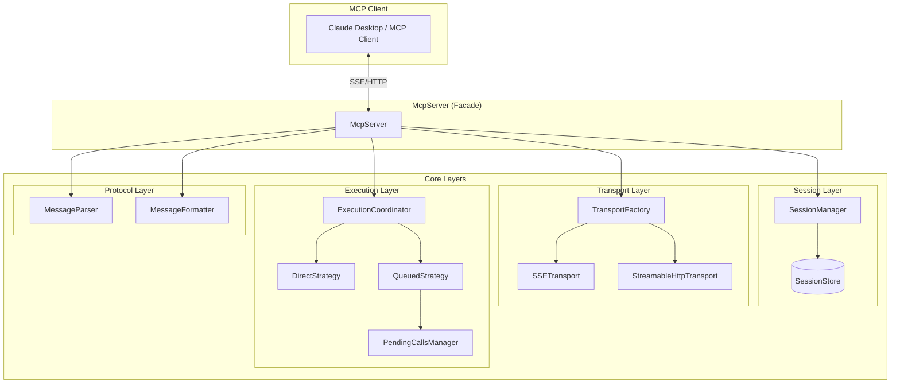

## Architecture

### Module Overview

| Module | Purpose |
|--------|---------|
| **McpServer** | Main entry point. Coordinates all subsystems. |
| **Session** | Manages client connections and tool registrations. |
| **Transport** | Handles communication protocols (SSE, Streamable HTTP). |
| **Execution** | Executes tools directly or via worker queue. |
| **Protocol** | Parses and formats MCP messages. |

### McpServer Facade

The `McpServer` class is the **main entry point** for all MCP operations. It implements the [Facade pattern](https://refactoring.guru/design-patterns/facade), providing a simplified interface that coordinates all the underlying subsystems.

#### Why a Facade?

Without the facade, consumers would need to:
1. Create and configure a SessionManager with a SessionStore
2. Create a TransportFactory
3. Create transports and wire up event handlers
4. Create an ExecutionCoordinator with a strategy
5. Parse incoming messages with MessageParser
6. Format responses with MessageFormatter
7. Wire everything together correctly

The `McpServer` facade handles all this complexity internally, exposing just a few high-level methods.

#### Singleton Pattern

```typescript
const mcpServer = McpServer.instance(logger);
```

`McpServer` is a **singleton** - only one instance exists per process. This ensures:
- All MCP requests share the same session registry
- Pending responses are tracked in one place
- Configuration changes (session store, execution strategy) apply globally

#### Request Flow Overview

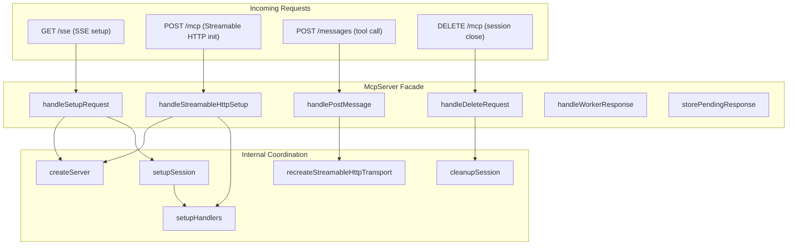

#### Public Methods

| Method | Purpose |
|--------|---------|
| `instance(logger)` | Get the singleton instance |
| `handleSetupRequest(req, resp, serverName, postUrl, tools)` | Handle SSE connection setup (GET request) |
| `handleStreamableHttpSetup(req, resp, serverName, tools)` | Handle Streamable HTTP initialization (POST with `initialize` method) |
| `handlePostMessage(req, resp, tools, serverName?)` | Handle incoming tool calls or list-tools requests. Returns `HandlePostResult` |
| `handleDeleteRequest(req, resp)` | Handle session termination |
| `handleWorkerResponse(sessionId, messageId, result)` | Route worker results back to clients (queue mode) |
| `storePendingResponse(sessionId, messageId)` | Track a pending response awaiting worker result |
| `hasPendingResponse(sessionId, messageId)` | Check if a pending response exists |
| `removePendingResponse(sessionId, messageId)` | Remove a pending response |
| `pendingResponseCount` | Getter for the number of pending responses |
| `getMcpMetadata(req)` | Extract session ID and message ID from a request |
| `getSessionId(req)` | Extract session ID from query string or header |
| `getTransport(sessionId)` | Get the transport for a session |
| `getTools(sessionId)` | Get the tools registered for a session |

#### HandlePostResult Type

The `handlePostMessage` method returns a `HandlePostResult` object:

```typescript
interface HandlePostResult {
  wasToolCall: boolean;              // Whether the request was a tool call
  toolCallInfo?: McpToolCallInfo;    // Info about the tool call (if any)
  messageId?: string;                // The JSONRPC message ID
  relaySessionId?: string;           // Session ID for relayed requests (queue mode)
  needsListToolsRelay?: boolean;     // Whether this is a list-tools request needing relay
}
```

#### Configuration Methods

| Method | Purpose |
|--------|---------|
| `setSessionStore(store)` | Replace the session store (e.g., InMemory → Redis) |
| `setExecutionStrategy(strategy)` | Replace the execution strategy (e.g., Direct → Queued) |
| `isQueueMode()` | Check if using queued execution |
| `getPendingCallsManager()` | Get the pending calls manager (needed for QueuedExecutionStrategy) |

#### Internal Coordination

The facade coordinates these internal operations:

| Internal Method | What It Does |
|-----------------|--------------|
| `createServer(serverName)` | Creates an MCP SDK `Server` instance with capabilities |
| `setupSession(server, transport, tools, resp)` | Registers session, sets up close handlers, connects server to transport |
| `setupHandlers(server)` | Registers `tools/list` and `tools/call` request handlers on the MCP server |
| `cleanupSession(sessionId)` | Cleans up pending calls, pending responses, and destroys the session |
| `recreateStreamableHttpTransport(...)` | Recreates a transport for an existing session (multi-instance scenarios) |

#### Queue Mode Behavior

In queue mode (multi-instance deployment), the facade has additional responsibilities:

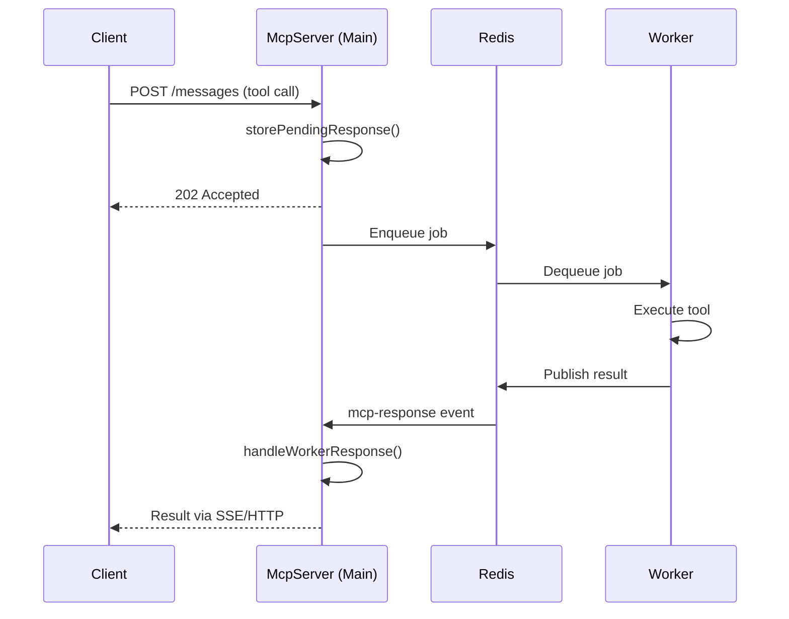

Key queue mode methods:
- **`storePendingResponse()`** - Tracks that we're waiting for a worker result
- **`handleWorkerResponse()`** - Routes the worker's result back to the correct client
- **`hasPendingResponse()`** / **`removePendingResponse()`** - Manage pending response state

## Layers

### 1. Protocol Layer

The Protocol layer handles the translation between raw HTTP request bodies and strongly-typed MCP data structures. MCP uses [JSONRPC 2.0](https://www.jsonrpc.org/specification) as its wire protocol, so every message from an MCP client is a JSONRPC request.

#### Why This Layer Exists

When an MCP client sends a request (e.g., "call tool X with arguments Y"), it arrives as a raw JSON string in the HTTP request body. The Protocol layer:

1. **Parses and validates** the raw JSON against the JSONRPC schema
2. **Identifies the request type** (tool call, list tools, etc.)
3. **Extracts the relevant data** (tool name, arguments) into typed structures
4. **Formats responses** back into the MCP-expected format

This keeps the rest of the codebase working with clean, typed data instead of raw JSON.

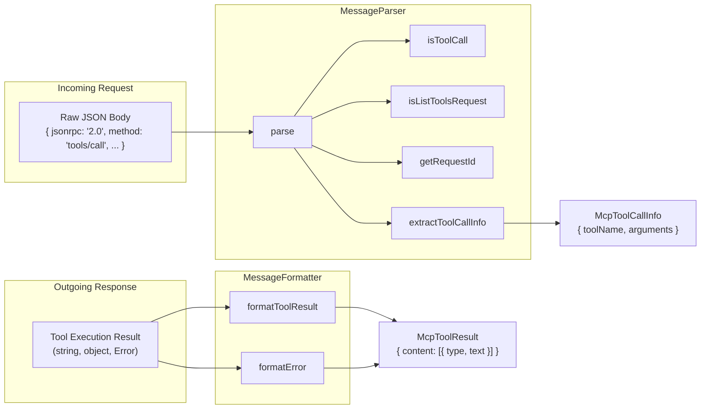

#### Types

```typescript
// Extracted info from a tool call request
interface McpToolCallInfo {
  toolName: string;                    // Name of the tool to invoke
  arguments: Record<string, unknown>;  // Arguments passed to the tool
  sourceNodeName?: string;             // Optional: n8n node that registered the tool
}

// Formatted result to send back to the client
interface McpToolResult {
  content: Array<{ type: string; text: string }>;  // MCP content blocks
  isError?: boolean;                                // Flag for error responses
}

// Special marker returned when handling list-tools requests
const MCP_LIST_TOOLS_REQUEST_MARKER = { _listToolsRequest: true };
```

#### MessageParser Methods

| Method | Purpose |
|--------|---------|
| `parse(body)` | Parses a raw JSON string into a validated `JSONRPCMessage`. Returns `undefined` if invalid. |
| `isToolCall(body)` | Returns `true` if the message is a `tools/call` request (client wants to invoke a tool) |
| `isListToolsRequest(body)` | Returns `true` if the message is a `tools/list` request (client wants to discover available tools) |
| `getRequestId(message)` | Extracts the JSONRPC request ID (needed to correlate responses with requests) |
| `extractToolCallInfo(body)` | Extracts the tool name and arguments from a tool call request into `McpToolCallInfo` |

#### MessageFormatter Methods

| Method | Purpose |
|--------|---------|
| `formatToolResult(result)` | Converts a tool's return value (string, object, etc.) into an `McpToolResult` with proper content blocks |
| `formatError(error)` | Converts an Error into an `McpToolResult` with `isError: true` and the error message |

#### Example Flow

```typescript
// 1. Client sends a tool call
const body = '{"jsonrpc":"2.0","id":1,"method":"tools/call","params":{"name":"get_weather","arguments":{"city":"London"}}}';

// 2. Parse and identify
MessageParser.isToolCall(body);  // true
MessageParser.isListToolsRequest(body);  // false

// 3. Extract tool info
const info = MessageParser.extractToolCallInfo(body);
// { toolName: 'get_weather', arguments: { city: 'London' } }

// 4. Execute tool and format result
const result = await executeTool(info);  // { temperature: 15, unit: 'celsius' }
const formatted = MessageFormatter.formatToolResult(result);
// { content: [{ type: 'text', text: '{"temperature":15,"unit":"celsius"}' }] }

// 5. Or format an error
const error = MessageFormatter.formatError(new Error('City not found'));
// { isError: true, content: [{ type: 'text', text: 'Error: City not found' }] }
```

**Files:**
- `types.ts` - Type definitions (`McpToolCallInfo`, `McpToolResult`, `MCP_LIST_TOOLS_REQUEST_MARKER`)
- `MessageParser.ts` - Parses raw JSON, identifies request types, extracts tool call info
- `MessageFormatter.ts` - Formats tool results and errors for MCP responses

### 2. Session Layer

The Session layer manages MCP client connections and their associated state (tools, transport, server instance). Each MCP client establishes a session when connecting, and that session persists for the lifetime of the connection.

#### Why Sessions Are Needed

MCP uses a stateful protocol where:
1. A client connects and establishes a session (via SSE or Streamable HTTP)
2. The client can then make multiple tool calls within that session
3. Each session has its own transport (for sending responses back) and set of available tools

Sessions allow the server to:
- Track which clients are connected
- Route responses back to the correct client
- Associate tools with specific client connections
- Validate that incoming requests belong to active sessions

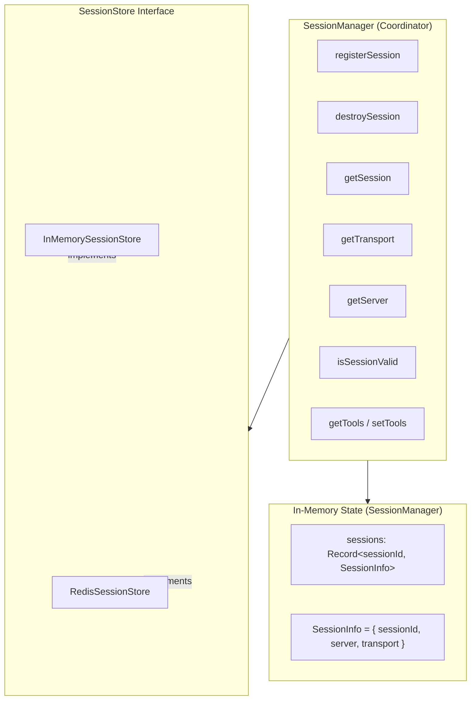

#### Two-Level Storage Architecture

The Session layer uses a two-level storage architecture:

| Storage Level | What It Stores | Why |
|---------------|----------------|-----|
| **SessionManager (in-memory)** | `SessionInfo` objects containing the MCP `Server` instance and `Transport` | These are runtime objects (WebSocket connections, SSE streams) that cannot be serialized or shared across processes |
| **SessionStore (pluggable)** | Session IDs (for validation) and Tools array | Can be backed by Redis for multi-instance deployments where sessions need to be validated across workers |

This separation allows:
- **Single-instance mode**: Use `InMemorySessionStore` (default) - everything stays in process memory
- **Multi-instance/queue mode**: Use `RedisSessionStore` - session validation and tools can be checked by any worker, while the actual transport/server objects remain on the main instance that holds the client connection

#### SessionStore Interface

```typescript
interface SessionStore {
  register(sessionId: string): Promise<void>;      // Register a new session
  validate(sessionId: string): Promise<boolean>;   // Check if session exists
  unregister(sessionId: string): Promise<void>;    // Remove a session
  getTools(sessionId: string): Tool[] | undefined; // Get tools for session
  setTools(sessionId: string, tools: Tool[]): void; // Associate tools with session
  clearTools(sessionId: string): void;             // Remove tools from session
}
```

#### SessionManager Methods

| Method | Purpose |
|--------|---------|
| `registerSession(sessionId, server, transport, tools?)` | Called when a new client connects. Stores the session info in memory and registers with the SessionStore |
| `destroySession(sessionId)` | Called when a client disconnects. Cleans up both in-memory state and SessionStore |
| `getSession(sessionId)` | Returns the full `SessionInfo` (sessionId, server, transport) |
| `getTransport(sessionId)` | Returns just the transport for sending responses back to the client |
| `getServer(sessionId)` | Returns the MCP Server instance for this session |
| `isSessionValid(sessionId)` | Delegates to SessionStore to check if session exists (useful in multi-instance setups) |
| `getTools(sessionId)` / `setTools(sessionId, tools)` | Manage the tools available for this session |
| `setStore(store)` / `getStore()` | Swap the SessionStore implementation (e.g., from InMemory to Redis) |

**Files:**
- `SessionStore.ts` - Interface for session storage
- `InMemorySessionStore.ts` - Default in-memory implementation (uses `Set` for sessions, `Record` for tools)
- `SessionManager.ts` - Coordinates session operations, holds runtime objects

### 3. Transport Layer

The Transport layer abstracts the communication protocol between the MCP server and clients. MCP supports multiple transport mechanisms, and this layer provides a unified interface so the rest of the code doesn't need to know which protocol is being used.

#### Why This Layer Exists

MCP clients can connect using different protocols:
- **SSE (Server-Sent Events)** - A long-lived HTTP connection where responses stream back to the client
- **Streamable HTTP** - Request-response based with optional streaming, more REST-like

Each protocol has different characteristics, but the server logic (handling tool calls, managing sessions) should be the same regardless. The Transport layer provides:
1. A **common interface** (`McpTransport`) that both protocols implement
2. A **factory** to create the right transport type
3. **Protocol-specific wrappers** that handle the differences internally

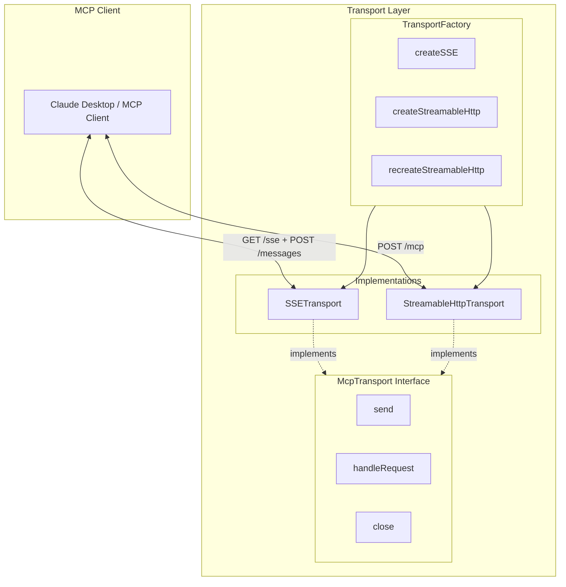

#### McpTransport Interface

```typescript
interface McpTransport {
  readonly transportType: 'sse' | 'streamableHttp';  // Identifies the transport type
  readonly sessionId: string | undefined;             // Session ID for this connection

  send(message: JSONRPCMessage): Promise<void>;       // Send a message to the client
  handleRequest(req, resp, body?): Promise<void>;     // Handle an incoming request
  close?(): Promise<void>;                            // Close the transport

  onclose?: () => void | Promise<void>;               // Callback when connection closes
}
```

#### SSE Transport

**Server-Sent Events** is a unidirectional streaming protocol where:
1. Client opens a long-lived GET connection to `/sse`
2. Server keeps the connection open and streams events (responses) back
3. Client sends tool calls via separate POST requests to `/messages`

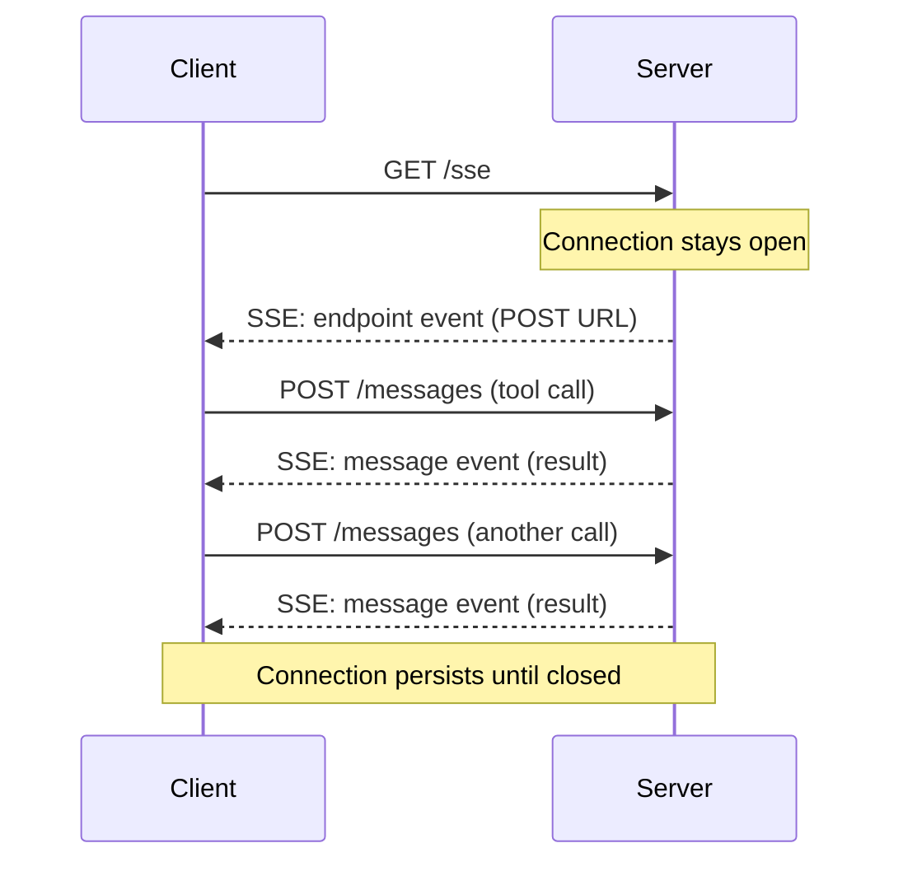

**Characteristics:**
- Long-lived connection (held open for the session lifetime)
- Responses stream back on the same connection
- Tool calls arrive via separate POST requests
- Session ID passed as query parameter (`?sessionId=...`)
- Good for real-time, continuous interactions

**Implementation:** `SSETransport` extends the MCP SDK's `SSEServerTransport` and:
- Adds the `McpTransport` interface
- Flushes the response after each send (for compression middleware compatibility)

#### Streamable HTTP Transport

**Streamable HTTP** is a request-response protocol where:
1. Client sends POST requests to `/mcp`
2. Each request can optionally stream responses back
3. Session continuity via `mcp-session-id` header

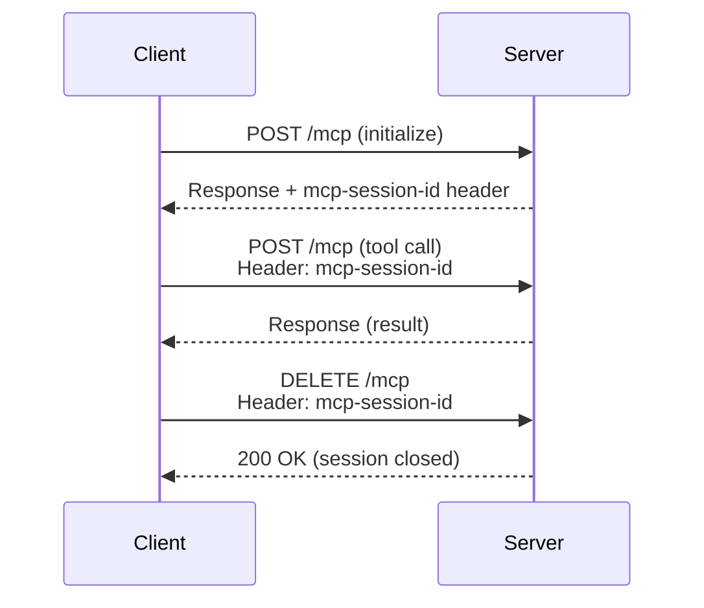

**Characteristics:**
- Request-response based (more REST-like)
- Session ID passed via `mcp-session-id` header
- Supports session recreation on different server instances
- Better for stateless/load-balanced deployments

**Implementation:** `StreamableHttpTransport` extends the MCP SDK's `StreamableHTTPServerTransport` and:
- Adds the `McpTransport` interface
- Provides `markAsInitialized()` for recreating transports with existing sessions
- Flushes responses for compression compatibility

#### TransportFactory

The factory creates transport instances with the right configuration:

| Method | Purpose |
|--------|---------|
| `createSSE(postUrl, response)` | Creates an SSE transport. `postUrl` is the URL clients should POST tool calls to. |
| `createStreamableHttp(options, response)` | Creates a Streamable HTTP transport with session initialization callbacks. |
| `recreateStreamableHttp(sessionId, response)` | Recreates a transport for an existing session (multi-instance scenarios). |

#### Transport Recreation (Multi-Instance)

In multi-instance deployments, a client might have established a session on Instance A, but a subsequent request lands on Instance B. The `recreateStreamableHttp()` method handles this:

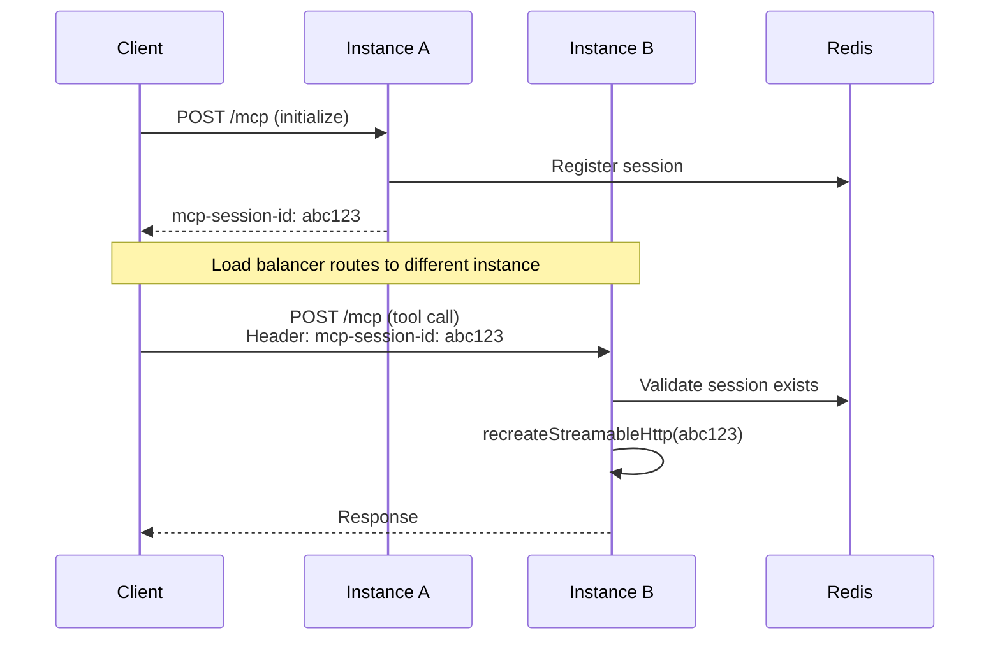

The recreated transport is marked as already initialized (via `markAsInitialized()`) so it skips the initialization handshake.

#### CompressionResponse Type

```typescript
type CompressionResponse = Response & {
  flush?: () => void;
};
```

This type extends Express's `Response` to include an optional `flush()` method. When using compression middleware (like `compression`), responses are buffered. Calling `flush()` forces buffered data to be sent immediately - important for SSE where responses need to arrive in real-time.

**Files:**
- `Transport.ts` - `McpTransport` interface and `CompressionResponse` type
- `SSETransport.ts` - SSE implementation wrapping MCP SDK's `SSEServerTransport`
- `StreamableHttpTransport.ts` - Streamable HTTP implementation wrapping MCP SDK's `StreamableHTTPServerTransport`
- `TransportFactory.ts` - Factory for creating transport instances

### 4. Execution Layer

Implements strategy pattern for tool execution, allowing different execution modes depending on deployment scenario.

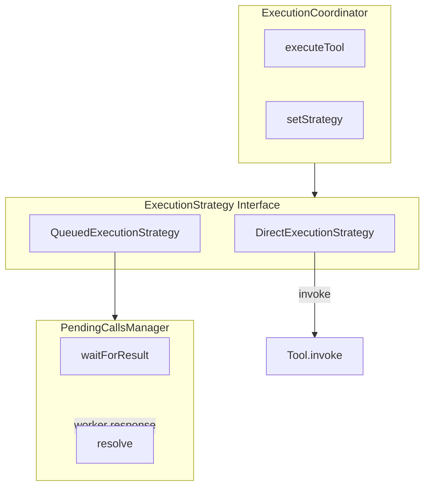

#### ExecutionStrategy Interface

```typescript
interface ExecutionStrategy {
  executeTool(
    tool: Tool,
    args: Record<string, unknown>,
    context: ExecutionContext,
  ): Promise<unknown>;
}

interface ExecutionContext {
  sessionId: string;
  messageId?: string;
}
```

#### DirectExecutionStrategy

The default strategy that executes tools immediately in the same process:

```typescript
const strategy = new DirectExecutionStrategy();
const result = await strategy.executeTool(tool, args, context);
// Directly calls tool.invoke(args)
```

#### QueuedExecutionStrategy

For multi-instance deployments where tool execution happens on worker processes:

```typescript
const strategy = new QueuedExecutionStrategy(
  pendingCallsManager,
  timeoutMs  // Optional, defaults to 120000ms (2 minutes)
);

// Methods for resolving calls from workers:
strategy.resolveToolCall(callId, result);  // Returns true if call was pending
strategy.rejectToolCall(callId, error);    // Returns true if call was pending
strategy.getPendingCallsManager();         // Access the pending calls manager
```

#### PendingCallsManager

Tracks tool calls waiting for results with automatic timeout handling:

```typescript
const manager = new PendingCallsManager();

// Wait for a result (with timeout)
const result = await manager.waitForResult(callId, toolName, args, timeoutMs);

// Resolve/reject from worker
manager.resolve(callId, result);
manager.reject(callId, error);

// Query and manage pending calls
manager.has(callId);                    // Check if call is pending
manager.get(callId);                    // Get pending call info
manager.remove(callId);                 // Remove without resolving
manager.cleanupBySessionId(sessionId);  // Clean up all calls for a session
```

**Files:**
- `ExecutionStrategy.ts` - Strategy interface and ExecutionContext type
- `DirectExecutionStrategy.ts` - Executes tools directly on main instance
- `QueuedExecutionStrategy.ts` - Delegates to worker, waits for response (default timeout: 120s)
- `PendingCallsManager.ts` - Tracks pending tool calls with timeout support
- `ExecutionCoordinator.ts` - Selects and invokes strategy

## Usage

### Basic Setup (Normal Mode)

```typescript
import { McpServer } from './McpServer';

const mcpServer = McpServer.instance(logger);

// Handle SSE setup
await mcpServer.handleSetupRequest(req, resp, serverName, postUrl, tools);

// Handle POST messages
const result = await mcpServer.handlePostMessage(req, resp, tools, serverName);
```

### Queue Mode Setup

```typescript
import { McpServer } from './McpServer';
import { QueuedExecutionStrategy } from './execution';
import { RedisSessionStore } from './RedisSessionStore';

const mcpServer = McpServer.instance(logger);

// Configure Redis session store
mcpServer.setSessionStore(new RedisSessionStore(publisher, getKey, ttl));

// Configure queued execution
mcpServer.setExecutionStrategy(
  new QueuedExecutionStrategy(mcpServer.getPendingCallsManager())
);
```

## Flow Diagrams

### SSE Connection Flow

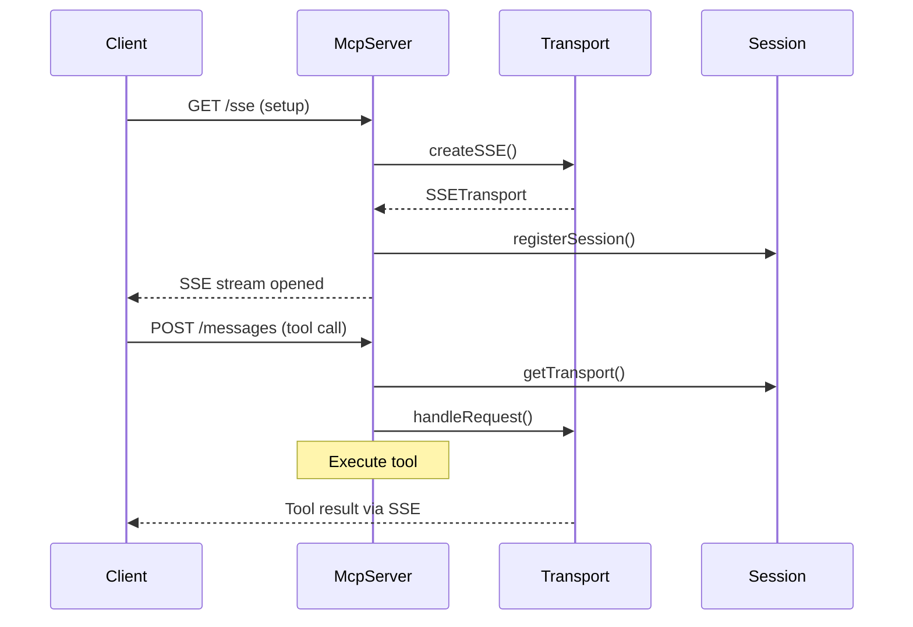

### Queue Mode Flow

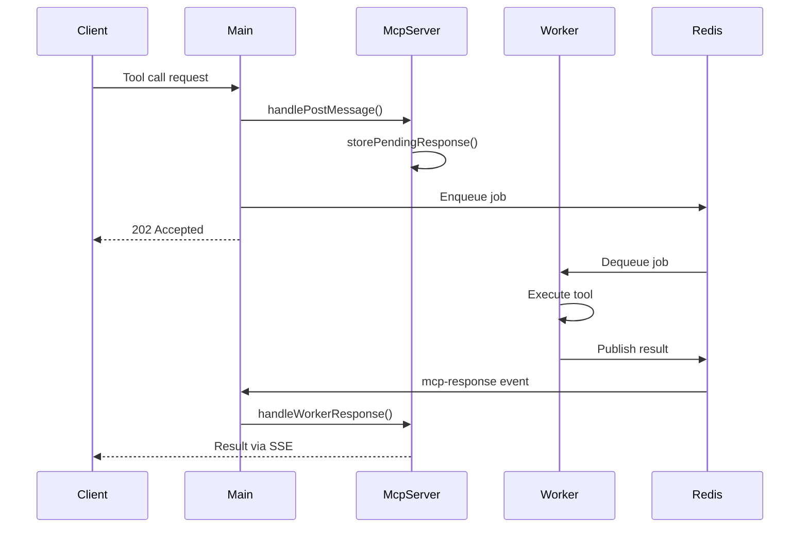

## Module Structure

```
McpTrigger/
├── McpServer.ts              # Main facade coordinating all subsystems
├── McpTrigger.node.ts        # n8n node implementation
├── protocol/                 # JSONRPC message parsing & formatting
│   ├── MessageParser.ts
│   ├── MessageFormatter.ts
│   └── types.ts
├── session/                  # Client connection & state management
│   ├── SessionManager.ts
│   ├── SessionStore.ts
│   └── InMemorySessionStore.ts
├── transport/                # SSE & Streamable HTTP protocols
│   ├── Transport.ts
│   ├── SSETransport.ts
│   ├── StreamableHttpTransport.ts
│   └── TransportFactory.ts
├── execution/                # Direct & queued execution strategies
│   ├── ExecutionStrategy.ts
│   ├── DirectExecutionStrategy.ts
│   ├── QueuedExecutionStrategy.ts
│   ├── PendingCallsManager.ts
│   └── ExecutionCoordinator.ts
└── __tests__/                # Comprehensive unit tests
```

### Imports

```typescript
// Main facade
import { McpServer, MCP_LIST_TOOLS_REQUEST_MARKER } from './McpServer';
import type { HandlePostResult } from './McpServer';

// Protocol
import { MessageParser, MessageFormatter } from './protocol';
import type { McpToolCallInfo, McpToolResult } from './protocol';

// Session
import { InMemorySessionStore, SessionManager } from './session';
import type { SessionStore } from './session';

// Transport
import { SSETransport, StreamableHttpTransport, TransportFactory } from './transport';
import type { McpTransport, CompressionResponse, TransportType } from './transport';

// Execution
import { DirectExecutionStrategy, QueuedExecutionStrategy, PendingCallsManager, ExecutionCoordinator } from './execution';
import type { ExecutionStrategy, ExecutionContext } from './execution';
```
